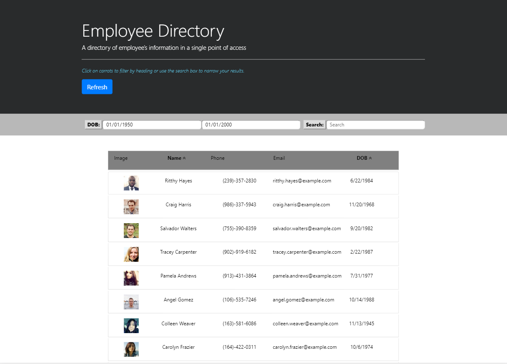

# Employee-Directory-React


## Table of contents
- [General Info](#Info)
- [Functionality](#Functionality)
- [Install](#Install)
- [Dependencies](#Dependencies)
- [Technologies](#Technologies)
- [Demo](#Demo)
- [Author](#Author)
- [License](#License)

# General Info

# Functionality

# Install

# Dependencies
``` bash
    "dependencies": {
    "@testing-library/jest-dom": "^4.2.4",
    "@testing-library/react": "^9.5.0",
    "@testing-library/user-event": "^7.2.1",
    "axios": "^0.19.2",
    "react": "^16.13.1",
    "react-dom": "^16.13.1",
    "react-router-dom": "^5.1.2",
    "react-scripts": "3.4.1"
  }
```

# Technologies
- HTML5
- CSS
- jQuery
- Node.js
- React
- Bootstrap

# Demo

# Author
- Lloyd Marcelino 
- github: https://github.com/ethanlloyd21
- website: lloydmarcelino.com
- email: lloydmarcelino@gmail.com

# License
- see MIT License Copyright (c) 2020